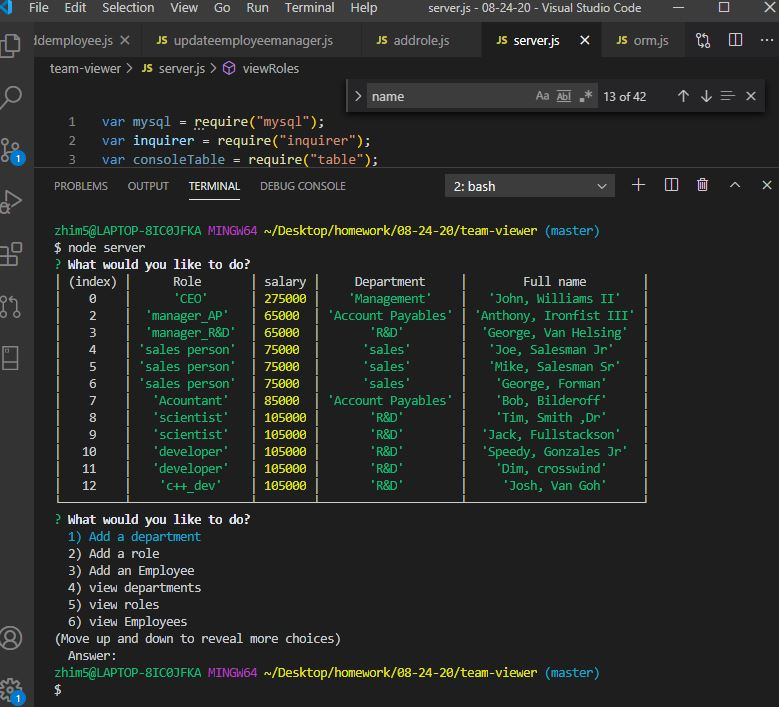
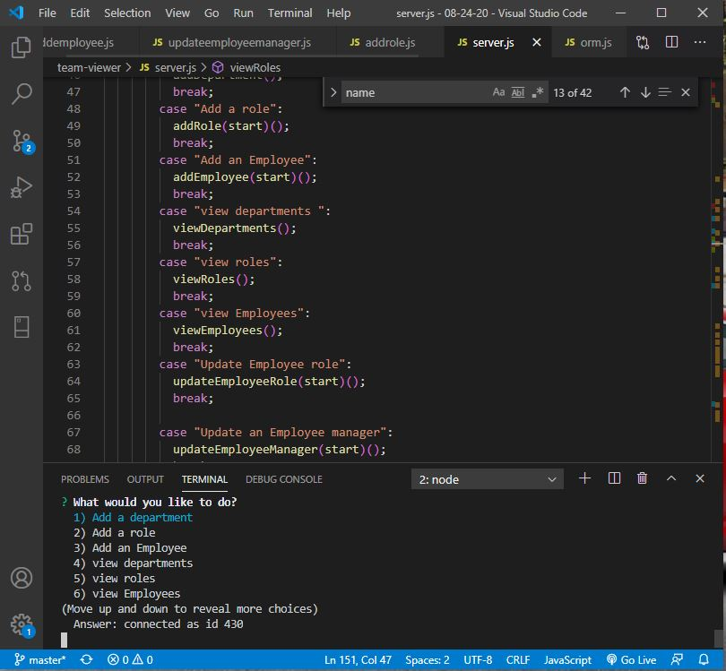

    
# Title : team-viewer

## Description
Author: Jivko Atanassov

This is an aplication for work with three mysql  data tables in order to provide easy access to different operations. Viewing employees , roles and departments ,editting them (ADD, Update,Delete), getting a department utilized budget etc.

Github User name: zhim57

## Table of Contents:
- [Title](#title)
- [Description](#description)
- [Table of Contents](#table-of-contents)
- [Installation](#installation)
- [Usage](#usage)
- [License](#licence)
- [Contributing](#contributing)
- [Tests](#tests)
- [Questions](#questions)

## Installation
npm install, npm add mysql express utill inquirer table 
## Usage
- Web development/front end
- Node.js  application
- Web development back end
- Database Application
- Productivity Application
- iOS App
- Android app
- entertainment application
- Financial App
- transportation application
- other
it is suitable for any organisation as atool to comprehend and undertand the structure and see actual departments , roles and employees.
## Email
zhim57@yahoo.com
## Contributing
none
## License

## Tests
usage tests

## Questions
please email Jivko Atanassov with any questions at: zhim57@yahoo.com. Thank You.

## Links

[link to this portfolio](https://github.com/zhim57/team-viewer)

[link to the deployed application]( heroku)
  

## Screenshots

  